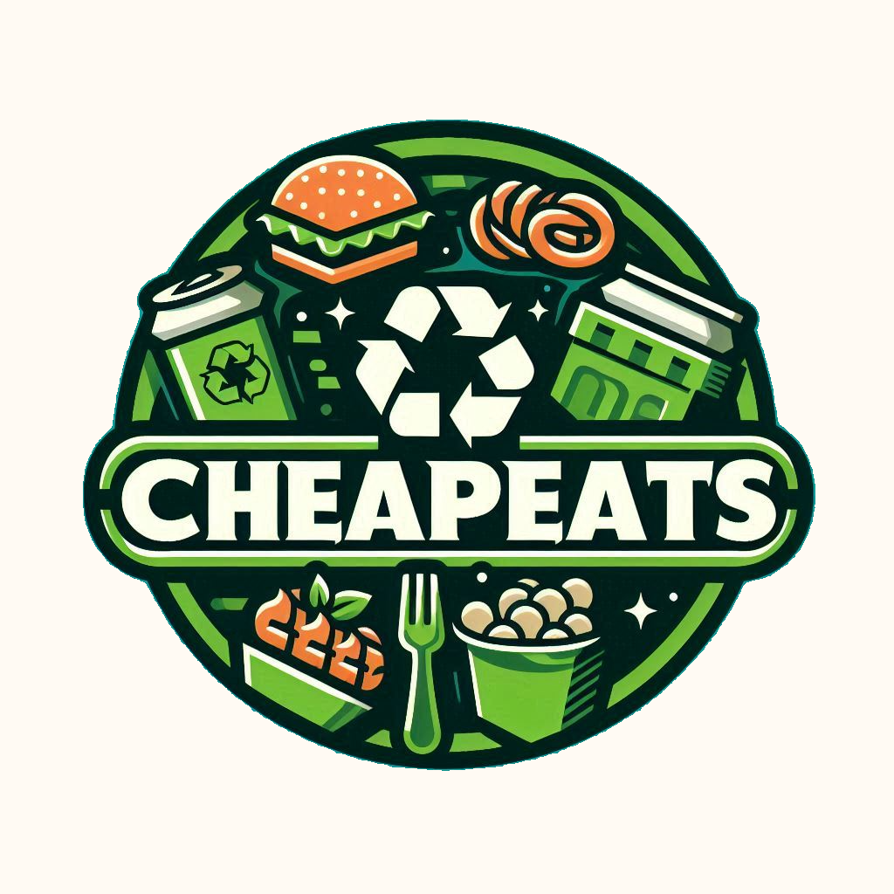
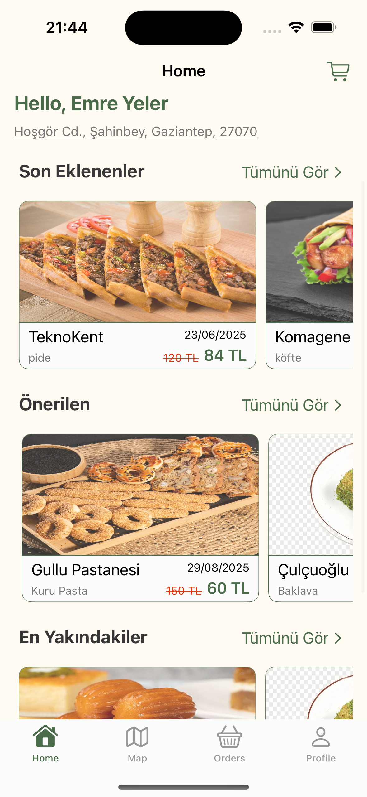
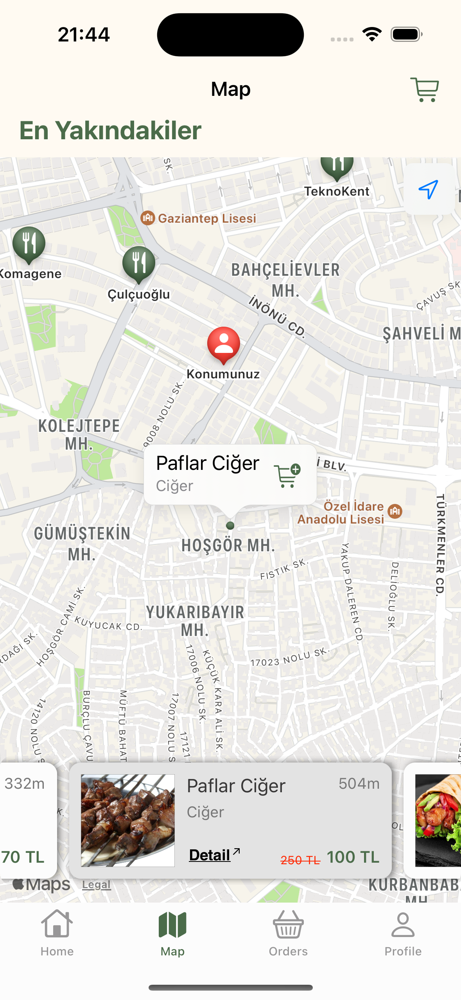
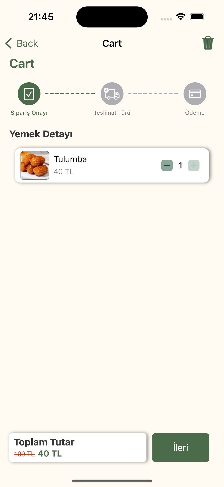
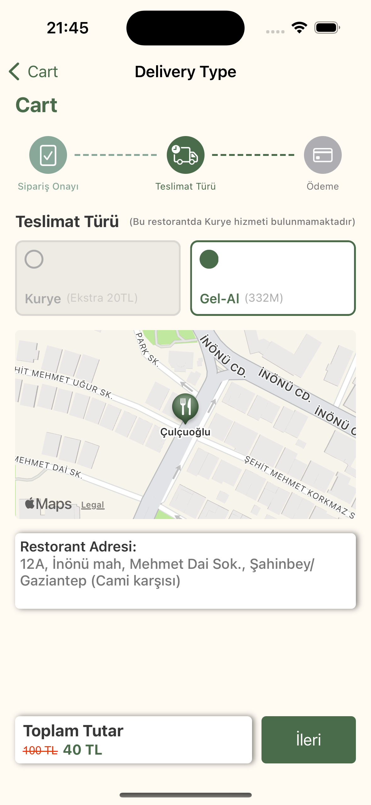
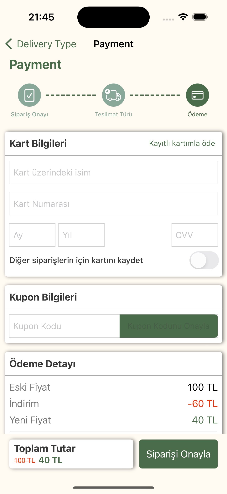

<h1 align="center">
   
  
   
  CheapEats
   
</h1>

<h4 align="center">Restoranlardaki günlük fazla yemekleri indirimli fiyatlarla sunan, gıda israfını azaltmayı hedefleyen iOS uygulaması 🍽️</h4>

  
  
  
  
  

  <a href="#-proje-hakkında">Hakkında</a> •
  <a href="#-ekran-görüntüleri">Ekran Görüntüleri</a> •
  <a href="#-öne-çıkan-özellikler">Özellikler</a> •
  <a href="#-kullanılan-teknolojiler">Teknolojiler</a> •
  <a href="#-geliştirici">Geliştirici</a>

---

## 📖 Proje Hakkında

**CheapEats**, restoran ve işletmelerin gün sonunda arta kalan yemeklerini indirimli fiyatlarla kullanıcılara sunmasını sağlayan bir mobil platformdur. Kullanıcılar harita üzerinden yakınlarındaki fırsatları keşfedebilir, gelişmiş filtreleme ile aradıkları yemeği bulabilir, kupon kodlarıyla ekstra indirim kazanabilir ve sipariş durumlarını anlık olarak takip edebilir.

%100 Swift ile geliştirilmiş olup, UIKit tabanlı modern iOS tasarım standartlarına uygun, MVVM mimarisi üzerine inşa edilmiş, Firebase altyapısıyla desteklenen kullanıcı dostu bir uygulamadır.

## 📱 Ekran Görüntüleri

  
  &nbsp;&nbsp;
  
  &nbsp;&nbsp;
  
  &nbsp;&nbsp;
  
  &nbsp;&nbsp;
  

## ✨ Öne Çıkan Özellikler

| Özellik | Açıklama |
|---------|----------|
| 🏠 **Ana Sayfa** | Son eklenen, önerilen ve yakınımdaki fırsatlar ile kişiselleştirilmiş ürün listeleme |
| 🗺️ **Harita Ekranı** | Yakındaki restoranları harita üzerinde pin olarak görme ve mesafe hesaplama |
| 🔍 **Gelişmiş Filtreleme** | 12 yemek kategorisi, fiyat aralığı ve mesafe bazlı çoklu filtre desteği |
| 🛒 **Sepet Yönetimi** | Ürün ekleme/çıkarma, adet güncelleme ve kalıcı sepet (uygulama kapansa bile korunur) |
| 📦 **Teslimat Seçenekleri** | Kurye ile adrese teslimat veya restorandan Gel-Al seçenekleri |
| 💳 **Ödeme Sistemi** | Kredi kartı ile ödeme, kart kaydetme ve kayıtlı kartlardan seçim (Mastercard/Visa/Troy) |
| 🎟️ **Kupon Sistemi** | Kupon kodu ile indirim uygulama ve tarih bazlı geçerlilik kontrolü |
| 📋 **Sipariş Takibi** | 5 aşamalı sipariş durumu takibi ve gerçek zamanlı bildirimler |
| 📄 **PDF Fatura** | Sipariş özetini PDF olarak oluşturma ve paylaşma |
| 🔐 **Kimlik Doğrulama** | E-posta/şifre ile giriş, kayıt ve şifre sıfırlama |
| 👤 **Profil Yönetimi** | Profil düzenleme, şifre değiştirme ve kredi kartı yönetimi |
| 🔔 **Anlık Bildirimler** | Sipariş durumu değişikliklerinde gerçek zamanlı banner bildirimleri |

## 🛠 Kullanılan Teknolojiler

| Kategori | Teknoloji |
|----------|-----------|
| **Dil** | Swift 5.9 |
| **Arayüz** | UIKit (Storyboard + XIB) |
| **Mimari Desen** | MVVM (Protocol-Oriented) |
| **Backend & Veritabanı** | Firebase Firestore |
| **Kimlik Doğrulama** | Firebase Authentication |
| **Harita & Konum** | MapKit, CoreLocation |
| **Yerel Depolama** | UserDefaults |
| **PDF Oluşturma** | PDFKit |
| **Rota Hesaplama** | MKDirections API |

## 👨‍💻 Geliştirici

- **GitHub:** [@EmreYlr](https://github.com/EmreYlr)
- **LinkedIn:** [Emre Can Yeler](https://www.linkedin.com/in/emrecanyeler/)
